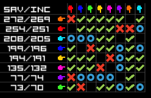
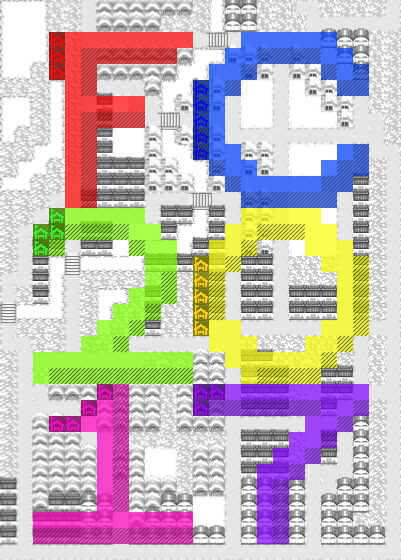
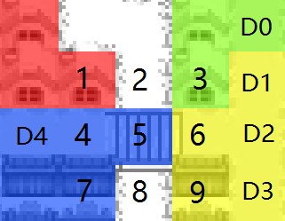

# 第14届 自动化系新生C语言大赛 ~~香菇滑稽杯~~ **百团大战**  逻辑文档暨比赛章程

> 修订：Du\wxk14<br>
> 规则：Du <br>
> 鸣谢：Pierre ;Starlight 
>
> 版本：version 4 update 2

## Getting Started —— 快速了解**百团大战**！


> “**百团大战**”是清华大学一项盛大的**社团**宣传活动。也是第14届新生C的主题。

本届自动化系新生C语言比赛的主题为“百团大战”。参赛选手编写Ai代码控制社团活动，在清华地图上，不断宣传和发展自己的社团，以赢取更多的社团领土和社员，夺取清华第一社团的桂冠。

本次新生C大赛有以下亮点：

**首次引入多AI混战**：和以往的2个AI纯粹对抗的形式不同，本届大赛的每一场比赛都是8个AI同场自由博弈。选手可以选择和其他AI并肩作战抵抗入侵，也可以占据有利地形快速扩张统一清华，更可以堵住路口隔岸观火。丰富的情景带来了丰富的战术选择，为AI的编写思路提供了更多空间。

**基于清华校园的二维地图**：二维的地图设计带来的是极其丰富的决策空间。游戏规则和围棋的设定非常类似，很大程度上锻炼了同学对矩阵信息的处理能力。此外，游戏地图基于清华校园设计，其地形特点和校园景观完全一致，因而大大增加了游戏的观赏乐趣。

### 规则概述

一个社团由**资源Saving/SAV**和**社员Member/Income/INC**构成。一个社员一回合产出1资源。一场比赛由8个社团同场竞技，之间无法直接获知其他AI的作者。

在8人自由博弈中，你将通过外交博弈的方式，确定同其他社团竞争或合作关系。**社团关系Diplomacy**有中立Neutral，合作Allied，敌对AtWar三种。



> 红叉=敌对，绿勾=同盟，蓝圈=中立。左侧是按照**社员人数INC**得到的排名。整张地图上有大概2000位社员。

社团通过**领土Area**获取社员。我校各区域的社员人数是非常不平衡的，例如紫荆宿舍区社员多，照澜院社员少。领土上社员数累加就是你的社员数。

社团要在己方/友方领土上设立一个**总部Capital**，否则你的社员将因为失去总部而陷入迷茫进而失去抵抗力`_(:зゝ∠)_`。

在合适的地点，举办合适规模的**社团活动Campaign/Military**是争抢领地和社员的关键，其地点只能在自己的领地内，规模正比于资源消耗。社团活动对周边9\*9的区域产生**招新/攻击Attack**和**内联/防守Defense**效果。

不同区域的同学对招新和内联的敏感程度不同。在道路上的同学就对招新特别感兴趣而难以内联，而在教学楼的同学对内联更感兴趣因而容易防守。这些由此地点**攻/防系数**决定。

现在，作为一名光荣的**社团社长**，你会如何在这 领土/资源/外交 的混战中，与各路社团斗智斗勇，力争清华第一社团呢？

百团大战，现在已经开始。期待你的表现！



> F区：万人食堂/图书馆，依仗水域和桥梁可稳健防守紫荆众大佬
> <br> C区：紫荆宿舍区/体育场，全清华社员最密集的区域，不过防守能力略差
> <br> 2区：近春园，大量的草地和水域，几乎没有社员，前期宣传时不要来这里
> <br> 0区：教学区，地图核心区域的大量教学楼，防守能力中等
> <br> 1区：照澜院，社员数量很少，另外在这里宣传有扰民的嫌疑啊
> <br> 7区：东门，很多教学楼，资源略少但防守能力不错，中期可前往照澜院继续发展

## 选手入门手册

首先进入[FC14官网](http://student.au.tsinghua.edu.cn/fc14)注册，然后点击“进入游戏”来到[选手页面](http://student.au.tsinghua.edu.cn/fc14dev)。

### 工具包

选手页面提供了[VS工具包](http://student.au.tsinghua.edu.cn/share/FC14/FC14_toolbox_user.zip)，使用VS2012及以上可以正常打开。如果您不使用VS，您可以选择下载[GNU工具包](http://student.au.tsinghua.edu.cn/share/FC14/FC14_toolbox_user_gnu.zip)。如有特殊需要，请与工作人员联系。

工具包内自带sample_ai和本地测试文件，您可以阅读readme文件，了解`config_*.txt`和`log_*.txt`文件的使用。

> `config_*.txt`为游戏配置文件，其中规定了要比赛的AI文件名称。
> `log_*.txt`为游戏日志文件，可以被UI程序读取。

以下以VS版本工具包为例：

解压压缩包。注意路径中不能含有中文。

打开Ai文件夹的VS工程文件`ai.sln`，然后直接编译运行即可。黑框闪过后，Ai文件夹下将多出`log_*.txt`文件，即游戏日志文件。

打开UI文件夹下的`test0.exe`文件，点击`LOAD`按钮，然后选择Ai文件夹下的`log_*.txt`文件，即可以查看游戏回放。

### 编写AI

您可以直接在sample_ai基础上进行修改。

您的AI需要完成3个功能，外交、活动举办(军事)、总部选取。

**外交**上有KeepNeutral/FormAlliance/JustifyWar这3个基本指令。
建议团结1~2个盟友以保证自己安全地进入游戏中盘。队友之间可以约定出生地点和行动规范以方便在战场上快速相互识别。
盟友之间应当相互扶持，这样才能以类似的积分进入下一轮~~否则下一轮根本见不到面~~。
在己方优势时(通过比较income确定)，要勇敢地挑起战争乘胜追击，以歼灭对手为目标。

**军事**的细节比较繁杂，不必过分追究。一般来说，在边界处均匀地放置活动以防守，在关键的区域投入重兵夺取和保护即可。
请务必注意防守：我方内部的几处星星之火，就可能在下一回合被敌人切入，进而导致领土被切断而崩盘~~帝国的覆灭~~。
地图地形有明显的攻防特征，例如万人最利于隔岸死守，紫荆最容易被搅局，学堂路和新民路是绝好的~~开车~~切入点，六教是关键的南北分界线等等。
一般来说，将己方内部杂点清干净，然后全力保护地图关键区域就可以稳住阵脚。在没有固定基地的情况下疯狂作战是大忌。

**总部**通常直接放在自己地图最深最安全的地方就可以了。总部是我方防御的提供者，需要好好保护。


### 提交代码

进入[选手页面](http://student.au.tsinghua.edu.cn/fc14dev)，点击“提交代码”，点击“提交AI”。

输入标题（会在AI排行榜中显示），然后将ai.cpp的内容复制到“cpp代码”框内。点击“创建”即可。

您可以提交有限个AI，并可以随时修改您提交的代码。

### 测试AI

进入[选手页面](http://student.au.tsinghua.edu.cn/fc14dev)，点击[AI排行榜](http://student.au.tsinghua.edu.cn/advanced/backend/web/ranking/index?sort=-score)，可以下载当前选手提交的编译过后的AI文件供您本地自由调试。

宿舍内部间可以直接拷贝dll文件测试你们之间的合作能力。

## 选手进阶手册

这是一款以**兵棋**为灵感的游戏，需要同时进行社团~~外交~~关系和~~军事~~活动安排两大策略的选择！

### Ai实现

代码需要实现以下这些函数或功能，建议以sample ai为模板直接修改。

- `birthplacePrice(map)` 决定为了*先手选择*出生地点而愿意*舍弃*的资源量。
- `birthplace(posSelected, map)` 在参考前面ai选择的出生地点之后，决定自己的出生地点。
- `player_ai(info)`
    - `DiplomaticCommandList` 外交指令
    - `MilitaryCommandList` 选择正确的位置和规模，举办活动
    - `newCapital` 放置社团总部

### 游戏流程一览 

- 出生竞价阶段(第0回合)，选手自行选择出生地点
    - 调用选手的 `birthplacePrice(map)` 得到竞价值
    - 按照竞价值高低的顺序调用 `birthplace(posSelected, map)` ，给出当前已经被选择的出生地点，得到此玩家选择的出生地点。
- 主阶段(第1回合~第49回合)
    -  `player_ai(info)`，给出游戏信息，并同时收取AI指令。
    - 主逻辑：
        - 外交。更新所有社团的外交关系。
        - 活动。更新社团领土，更新社团总人数。
        - 总部。尝试将社团总部放在你此回合指定的地方。
        - 确认地图。所有领土检查自己是否能通过己方/友方领土连接到己方/友方总部，若发现无法连接到总部，则这些领土*下回合*不计算*防御力*~~，因为失去了信仰而陷入深深的迷茫~~，。
        - 生产。社团每个人生产1资源。

### 活动影响力 & 领土判定

每个活动都会对9\*9的区域产生**影响力**：水平和竖直方向上的影响力数值比较高，对角线方向上衰减很快。

我们将这个二维矩阵称为**kernel**。

```
 0.05  0.1  0.1  0.2  0.4  0.2  0.1  0.1  0.05 
 0.1   0.1  0.2  0.3  0.7  0.3  0.2  0.1  0.1  
 0.1   0.2  0.3  0.5  0.8  0.5  0.3  0.2  0.1  
 0.2   0.3  0.5  0.8  0.9  0.8  0.5  0.3  0.2  
 0.4   0.7  0.8  0.9  1.0  0.9  0.8  0.7  0.4  
 0.2   0.3  0.5  0.8  0.9  0.8  0.5  0.3  0.2  
 0.1   0.2  0.3  0.5  0.8  0.5  0.3  0.2  0.1  
 0.1   0.1  0.2  0.3  0.7  0.3  0.2  0.1  0.1  
 0.05  0.1  0.1  0.2  0.4  0.2  0.1  0.1  0.05 
```

最终你所有活动的影响力，将累加起来形成一张完整的影响力图。也就是所谓*卷积*操作。

每个格子有独立的地形参数，攻击系数`atk`，防守系数`def`；
记这个格子上的*攻击方*的影响力的值为`atk_influ`，*防守方*的影响力总和的值为`def_influ`，则

`atk * atk_influ - def * def_influ >= 400 `

即为*击破*！

### 清华地形参数


这是我们使用的清华地形图。不同的地形有不同攻/防/资源，以下分别介绍：

- 社员密集的地形
    - 宿舍： 攻/防 20/20  社员数 8  
        - 宿舍集中在地图的东北，资源最丰富。攻守均衡。
    - 教学楼： 攻/防 20/30  社员数 5
        - 教学楼分布在地图的核心地带（西南角的北大那里也有一点）。防守能力优秀，资源量也很丰富。是可靠的防守据点。
    - 操场： 攻/防 30/20  社员数 5
        - 操场主要分布在宿舍区。在游戏的初期很容易攻击下来，资源量也很高，但防守能力差。
- 攻防鲜明的地形
    - 道路：  攻/防 30/10  社员数 2
        - 道路遍布学校各地，几乎无法防守。利用道路的特性快速切断和冲入敌方阵地，是非常有效的进攻手段。
    - 水：  攻/防 0/20  社员数 0
        - 水是无敌的。可以出生在水上，但从第一回合开始，水上的领土会自爆。
    - 桥：  攻/防 10/15  社员数 2
        - 桥是关键的防守位置，守住桥就可以把对手封锁在河对岸。地图的西北万人/图书馆可以用这样的思路防守。我们计算一下，拿下一座桥，至少要在相邻的格子进行规模 `400 / 10 / 0.9 = 45` 的社团活动。
    - 桥两岸的道路：  攻/防 15/15  社员数 2
        - 桥左右2格道路的攻防参数得到了强化。
- 其他地形
    - 草： 攻/防 10/10  社员数 1
        - 并不推荐占领这样的地形。不过在必要的时候，草的防御力也不错。
    - 居民区/商业区： 攻/防 20/20  社员数 1
        - 到这些区域进行宣传就是扰民了。但大片大片占领的话，还是能为你提供不少社员的。

## 赛程

- 热身赛
    - 选手可以自愿的上交自己的AI到服务器端存储。若如此做，视为选手同意组委会安排其AI与其他AI对战。
    - 您可以上传有限个AI，这些AI将同等地进入热身赛测试。
    - 热身赛按照初赛规则进行，并将公布您各个AI的得分。
    - 所有参与热身赛的AI将公开其动态链接库文件，供其他选手自由下载测试。
- 初赛
    - 初赛将于第六周周末举行
    - 初赛前我们将确认参赛资格，请选手通过清华邮箱发送初赛Ai文件和选手基本信息。
    - 初赛中，一名选手只能上交一份Ai文件。禁止抄袭代码。
    - 初赛按照瑞士轮规则进行：
    ```
    //TODO
    用sample_ai把参赛人数补充成8的倍数
    打乱参赛人员顺序
    do {
        按照排名每8名进行一场，按照排名分别获得 5,3,2,1,1,1,0,0 分
        重新排名
    } while 指定要求前
    ```
- 决赛
    - 决赛将于第十周举行
    - 只有初赛晋级的玩家参赛。
    ```
    //TODO
    循环对战N次
    累积得到总分
    ```

## Ai编写教程 & 完整规则

### 竞价/出生阶段 指南

#### birthplacePrice(map) 

出生竞价。刚开始时作为社长你有 `INITIAL_PLAYER_MONEY=50` 的资源。

第1回合的经济非常重要，手上最好多留一些钱。返回0~5资源比较合适。

#### birthplace(posSelected, map)

这里你可以知道哪些点已经被选出来了，所以出钱少也有后手优势。

在选择出生点时，不要距离其他Ai太近，尽量选择资源比较丰富，容易攻击下来的区域。若没有富裕的区域，选不那么富裕但是空旷的区域也不错。

总之小心不要在开局就被其他多个Ai包围。按照内测的情况来看，最后一名（场上第一个被全灭的社团）通常都是在紫荆宿舍开局结果被rush的玩家。

 **注意** 出生地点之间的曼哈顿距离不能小于 `MIN_ABS_DIST_BETWEEN_CAP=3`。防止贴脸出生，没有生存空间。


### 外交 指南

因为外交指令在军事指令之前处理，所以你应该先考虑和其他社团的外交关系。

对其他每个已经在你的视野中出现的社团，你有4个**外交指令DiplomaticCommand**可供选择：

- KeepNeutral保持中立
    - 最常规的选择。你们不会变成同盟。但是对方可以向你宣战。
- FormAlliance默许同盟
    - 如果对方恰好也是“默许同盟”，你们就成功同盟了。
    - 同盟期间，两个玩家中的任何一个选择了“默许同盟”之外的指令，同盟都会立即解散。
- JustifyWar战争合理化/宣战
    - 任何一方*连续三回合*使用JustifyWar，你们就将在第三个JustifyWar发出的回合变成敌对状态。相当于前2回合的JustifyWar是在准备，第3回合的JustifyWar就可以果断出兵了。
    - 战争期间，只要任何一方仍然在使用JustifyWar，战争就将继续。
    - 在对方发出前2个JustifyWar时，你不会得到任何通知，只知道你们之间的外交关系为中立。
- BackStab背刺
    - 外交指令中最具戏剧性的一个，效果是不论如何立即发动战争。对同盟/中立的对手都可以使用。内测期间，这个指令大量地在紫荆宿舍区发生。

**注意** BackStab指令，一个社团只能用一次，由`info.backstabUsed`标识。无法知道其他玩家是否使用了背刺。

**注意** 社团需要为每个FormAlliance指令支付*对方*收入的`UNIT_AREA_ALLY_COST=5%`的资源。社团需要为每个JustifyWar指令支付`WAR_JUSTIFY_PRICE=5`的资源。

**注意** 玩家可以通过 player.warList 查看此玩家正在和哪些玩家处于战争关系。~~牵一发而动全身/螳螂捕蝉黄雀在后/鹬蚌相争渔翁得利~~


### 外交 视野

外交关系决定了你的视野范围。如果不同盟的话，你是无法看清全图的局势的。

外交视野分为**地图视野**和**社团内政视野**

- 地图视野
    - 你能看到对你联盟的国家领土加相邻的2格范围，得知这些土地的主权。
    - 对于你没有视野的土地，你只能获得土地的攻/防/资源参数。
- 社团内政视野
    - 未发现：你无法获得此社团的任何内政信息
    - 中立/敌对：你可以获得此社团的
        - 领土总面积；与该社团处于敌对的社团列表；当前社员数。
    - 同盟：你可以获得此社团的
        - 总部位置；当前资源量；
    - 注：只有你自己知道你手上还有没有背刺！

### 活动 指南

在考虑完外交情况之后，你应该已经很清楚你有哪些敌人了！只要有敌人，你就应该...努力地举办活动应对危机&机遇！

比较简单的思路是在边界均匀放置多个活动以均衡攻防。你可以在你觉得关键的区域多放置一些资源；不过当然，过多和过分集中的资源又可能造成浪费，这主要是由kernel的大小和形状决定的。

在紫荆宿舍区这样防御弱的地形上对战时，你很有可能打入了一块与总部不相连的飞地。这样深入到敌后的区域会让敌方非常头痛，因为这些飞地的面积虽然小，但却暴露了太多脆弱的区域。

**注意** 我们回到`atk * atk_influ - def * def_influ >= 400 `上来。`atk_influ`是每个玩家分别计算的，只有这个数值最高的玩家才有机会获得领土。如果有多个玩家以相同的攻击力击破，则领土变成中立。`def_influ`是领土主人和其同盟之间的影响力累加得到的。就算敌人很强大，同盟们在关键区域同时防守，就能挡住对方的攻势。

**注意** 你的有效的活动数目不能超过`MILITARY_COUNT_LIMIT=32`个，即只能选择这么多个点放置资源。

**注意** 由于外交上的变化（对方解除了同盟），你的活动指令可能会忽然变得不合法。此时这些指令将自动被判为无效。

### 总部 指南

你应该将总部放在最安全的地方。只有你的总部存在，才计算防御力。一旦你失去了总部（指定了一个总部的位置，然而在本回合的军事阶段后，这个位置不是己方/友方的），在下回合你所有的领土都没有防御力，只能任人宰割...

此外，所有无法通过己方/友方领土连接到己方/友方总部的区域，在下一回合也不计算防御力。

如果你地图的形状非常不好，例如已经被分成了两大块。这时至少有1块是没有防御力的，做何取舍，或者强行将你的连接成一片，这就看你的打算了。

总部通常放在己方领土最深的地方，这里保证不会被打扰。放在自己炸弹最强且防御最高的地方也不错。

**注意** 如果你本回合的首都存在，你的**本回合**首都所在位置将自动视作举办一次`(CAPITAL_INFLUENCE=0.3)*income`规模的活动。所以在合适的场合，赌上社团的荣誉，让你的总部率领你的社员一起出征吧！

**注意** 如果失去了总部，将不进行总部连通性判定，下回合全部领土直接失去防御力。


### 资源 指南

资源是这个游戏的关键。

每回合，你的基本收入是：全部领土上的同学+1（社长你啊）。

为了防止疯狂攒钱，每回合你手上剩下的钱都会遭到折损，也就是变成原来的 `(1-income*(CORRUPTION_COEF=0.0003))` 倍。

**举例** 一个400人的社团，每回合的剩余资金将在生产回合直接乘上`(1-0.0003*400)=0.88`。`0,400,752,1061,1333,1573` 这样5回合可以得到这么多钱。

可以方便的计算出，对任何一般规模的社团，`3333`是资源的极限值。

此外，若总部存在，每个社团每回合还能得到`(UNIT_CITY_INCOME=1.0)*round`的低保。


### 排名判定

排名按照社员数进行。

如果你已经没有领土了，你将直接被判出局。出局越早排名越低。

从第`STRICT_ROUND_START=10`回合开始，社员数少于`round-STRICT_ROUND_START`的玩家将被迫出局。

最终成绩按照最后一回合的社员数，和出局的顺序决定。

## 附录

### 地图 推荐出生点

- 桃李/紫荆
    - 坐拥紫荆宿舍区，前期经济大好
    - 但由于经济大好的原因一定会被稍有智商的AI联合怼。
    - 紫荆宿舍区道路密布，很容易被飞区切入然后换家。
    - 如果大家都选桃李/紫荆开局，那大家活得都不好。
- 万人/新老馆/小桥
    - 坐拥新馆老馆/理科院系楼，前期经济尚可
    - 但是在向东渡河的时候会遭遇很大的困难
    - 可以往南过河发展，但有很长的路要走
- 文图/三六教
    - 研究生宿舍楼，前期经济不错
    - 抵抗紫荆大佬的最前沿
    - 但是学堂路和新民路都是出了名的易攻难守，毫无纵深可言。
    - 倘若在此埋伏一彪人马，忽然杀出将我等围住，那么我军即使不全军覆没，也难免死伤惨重啊！（曹操大笑脸）
- 经管/法学院/李兆基
    - 全是教学楼，前期经济不错
    - 会在中主和六教势力激烈交火
    - 照澜院是天然屏障，前期肯定没人
- 照澜院/近春园
    - 诸位不要想不开啊。。。
- 北京大学
    - 地图总共4个角，只有西南角的北大物理学院有负隅顽抗的实力
    - ~~刚才我很想啊，就我每次碰到你们，我就想到——中国有句话叫“闷声发大财”~~

### 领土判定详细说明

活动的影响力只保留一回合。只有领土的变更继承到下一回合。

**注意** 只有处于敌对关系的社团之间才有可能发生领土变更。

对每块土地，首先计算其防御力。`防御力=同盟影响力之和*防御系数`。
然后分别计算每个玩家的对这块土地的攻击力。`攻击力=自己的影响力*攻击系数`。
若存在`攻击力>=防御力+400`，则这块土地临时变成中立。

此时找到攻击力最高的2个玩家。若其攻击数值相等，则此土地确认变成中立。

若存在攻击力唯一最高的玩家，则这块土地成为此玩家的**攻破区**。对攻破区进行判定，若攻破区域和此玩家的己方/友方领土相连，则这块土地确认变成此玩家的领土。否则变成中立。

**注意** 所以社团的同学们是直接无法游泳到河对岸的，最多只能通过活动宣传把河对岸的同学变成中立，~~好好玩哦！但是过不去怎么报名呀~~。想要过河，至少要得到一回合桥梁的控制权。

### 领土判定举例



外交关系是，红蓝同盟，蓝黄绿两两敌对，其余中立。

现在红在1放50，蓝在5放70，绿在3放150，黄在6放110。


结果如图：


  ```
  这里是听涛园旁边的桥梁。2和8是水域，不可能被攻占。
  5是桥，攻防10/15。4,6是桥边的道路，攻防15/15。
  1,3宿舍，攻防20/20。7,9教学楼，攻防20/30。


  桥两岸
  4: 蓝防守=400+15*(50*0.9+70*0.9)=400+15*108；绿攻击=15*(150*0.5)=15*75，黄攻击=15*(110*0.8)=15*88，均不能攻破
  5: 蓝防守=400+15*(50*0.8+70*1.0)=15*110=400+1650；绿攻击=10*(150*0.8)=1200，黄攻击=10*(110*0.9)=990，均不能攻破
  6: 黄防守=400+15*(110*1.0)=15*110=400+1650=2050；绿攻击=15*(150*0.9)=15*135=2025，蓝攻击=15*(70*0.9)=945，均不能击破
  
  宿舍
  1: 红防守=400+20*(红50*1.0+蓝70*0.8)=400+20*106；A没有敌对势力不算攻击力
  3: 绿防守=400+20*(150*1.0)=400+20*150；蓝攻击=20*(70*0.8)=20*56，黄攻击=20*(110*0.9)=20*99，均不能攻破
  
  教学楼
  7: 蓝防守=400+30*(70*0.8+50*0.8)=400+2880；绿攻击=20*(150*0.3)=900，黄攻击=20*(110*0.5)=1100，均不能攻破
  9: 黄防守=400+30*(110*0.9)=400+2970；蓝攻击=20*(70*0.8)=1120，绿攻击=20*(150*0.8)=2400，均不能攻破
  
  道路
  D0: 绿防守=400+10*(150*0.8)=1600；蓝攻击=30*(70*0.3)=630，黄攻击30*(110*0.5)=1650，黄击破（且连通判定成功）
  D1: 黄防守=400+10*(110*0.8)=400+880；蓝攻击=30*(70*0.5)=1050，绿攻击30*(150*0.9)=4050，绿攻破（且连通判定成功）
  D2: 黄防守=400+10*(110*0.9)=400+990；蓝攻击=30*(70*0.8)=1680，绿攻击30*(150*0.8)=3600，蓝绿同时超过阈值，记做绿攻破（且连通判定成功）
  D3: 黄防守=400+10*(110*0.8)=400+880；蓝攻击=30*(70*0.5)=1050，绿攻击30*(150*0.5)=2250，绿击破（且连通判定成功）
  D4: 蓝防守=400+10*(70*0.8+50*0.8)=400+960；绿攻击=30*(150*0.3)=1350，黄攻击=30*(110*0.7)=2310，黄击破（但连通判定失败），变成中立
  
  ```

很明显河西万人一侧的红蓝经济情况不好，但两个玩家用50+70的经济联防，完全能将对手挡在外面。这一现象常被万人方面军用于死守紫荆大佬，反过来也一样。道路的防守能力非常弱，图中展示的D0~D4全部被击破。道路的互换会造成许多非常复杂的局面，也造就了更多的机会。

### 利用回合的时序实施战术动作

- 攻击一个中立社团：主动宣战，并在战争生效的回合部署重兵，几乎可以保证打出先手速攻。
    - 友情提示：如果不能一回合达到战术目的，请考虑准备预备队。
    - 如果一回合打崩对面总部当然更好，下回合直接强势全部招新；所以后期请务必注意总部的站位。
- 利用同盟瞬移：主动请求同盟，同时尝试在对方领土的边缘部署兵力。如果对方不同意同盟，你在对方边境的部署命令将被忽略；而如果对方同意了同盟，你将能够立即在很远的地方扩展出自己的领土。
    - 友情提示：下回合被盟友卖了就亏了

### 签订统一战线的外交协议

如果你们无法在~~军事~~活动举办上取得优势，尝试和队友在外交上搞一搞小动作也是极好的选择。

在游戏中你并不能直接知道其他Ai的主人是谁，所以同一个宿舍的同学如何在比赛中互帮互助可是一门有趣而复杂的学问。

作为宿舍统一战线的一员，你们可以约定

- 30回合之前外交上不宣战（所以在30回合前跟你打起来的一定是坏人）
- 在存活玩家小于等于4之后不宣战，关键时刻联手反攻，轻松进前三（看你的队友能不能活到这个时候了）
- 约定固定的出生地点然后在小桥胜利会师（小心奇怪的人混进来）
- 使用类似的宣战判定方法，以方便与队友同时发动奇袭（小心窝里斗）

总之，外交策略上的成功将为你的胜利提供非常大的帮助。

而这些外交协议，当然得由你们自己来制定。


​