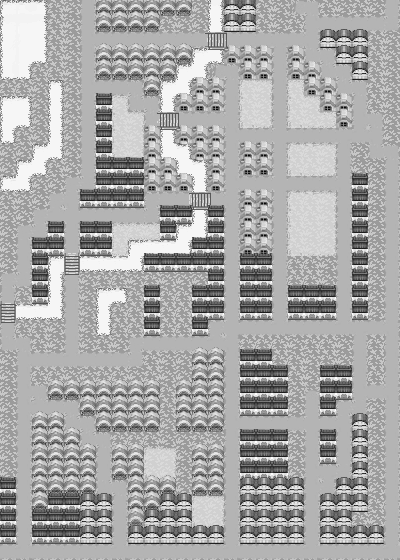

# 第14届 自动化系新生C语言大赛 ~~香菇滑稽杯~~ **百团大战**  逻辑文档暨比赛章程

> 修订：Du\wxk14<br>
> 规则：Du <br>
> 鸣谢：Pierre ;Starlight 
>
> 版本：version 4 update 1

## Getting Started —— 快速了解**百团大战**！


> “**百团大战**”是清华大学一项盛大的**社团**宣传活动。也是第14届新生C的主题。

本届自动化系新生C语言比赛以“百团大战”为主题。参赛选手编写Ai代码，在清华地图上，进行**社团活动**的安排，不断宣传和发展自己的社团，赢取更多的**社团领土和社员**，夺取清华第一社团的桂冠。

一个社团具有以下属性：

- 基本
    - 资源 Saving 
    - 社员人数 Member 
        - 1个社员1回合生产1资源。
- 地图 Map
    - 社团领土 Area   
        - 清华地图分成25\*35个格子。游戏的目标是占领尽量多的清华地图。
        - 1个格子最多属于1个社团。无主的格子通过*招新*就变成社团领土。
        - 社团领土决定社团人数，即每个领土格子上的同学人数累加。不同类型格子上的同学人数是固定的。
    - 社团总部 Capital
        - 1个社团有1个总部，占1个格子，要设在己方/友方社团领土上。
        - 社团总部是*内联*的关键要素，~~是社团的灵魂~~，~~信仰的来源~~！
- 社团关系 Diplomacy
    - 中立 Neutral 
        - 默认的社团关系。双方不会互抢社员。双方只相互看到一些基本信息。
    - 友好 Allied
        - 社团间的合作关系。双方不会互抢社员。双方分享大多数信息。*内联*对对方同时生效并累加。
    - 敌对 AtWar
        - 特殊的社团关系，需要特殊行动(背刺)，或者一段时间的宣战之后才能建立。此时*招新*对对方社员生效，因此可以互抢社员。
- 社团活动 Campaign/Military 
    - 举办社团活动必须指定 活动地点 和 活动规模。
        - 活动地点 必须是己方/友方社团领土。
        - 活动规模 正比于消耗资源，也正比于产生的效果。
    - 社团活动有2个效果：
        - *招新(攻击)*：对附近敌对/中立土地产生影响，将土地上同学变成我们的社员。
        - *内联(防守)*：对附近己方/友方土地产生影响，防止土地上的社员被敌对社团抢走。
        - 不同区域的*招新(攻击)/内联(防守)* 效果是不同的，例如 *道路* 上的同学特别容易被 *招新(攻击)* 而改变社团，而 *教学楼* 里的同学只要稍微进行一下*内联(防守)*，就能留在社团里。

现在，作为一名光荣的**社团社长**，你会如何在这 领土/资源/外交 的混战中，与各路社团斗智斗勇，力争清华第一社团呢？

百团大战，现在已经开始。期待你的表现！


## 选手进阶手册

这是一款以**兵棋**为灵感的游戏，需要同时进行~~外交~~社团关系和~~军事~~活动安排两大策略的选择。

### Ai实现


你的AI需要实现以下这些函数或功能

- `TMoney birthplacePrice(BaseMap* map);` 决定为了*先手选择*出生地点而愿意*舍弃*的资源量。
- `TPosition birthplace(vector<TPosition> posSelected, BaseMap* map);` 在看了前面ai选择的出生地点之后，决定自己的出生地点。
- `void player_ai(Info& info);`
    - `vector<TDiplomaticCommand> DiplomaticCommandList;` 外交指令
    - `vector<TMilitaryCommand> MilitaryCommandList;` 整个游戏的核心，选择正确的位置和规模，举办活动
    - `TPosition newCapital;` 找一个安全的位置放置社团总部，~~保护你们的信仰~~

这个游戏的完整规则比较复杂，建议从sample ai为模板直接修改。

### 游戏流程一览 

在观看几场示例对战之后，在进入清华·百团大战之前，我们先确定一下游戏流程：

- 出生竞价阶段(第0回合) 选手自行选择出生地点
    - 主逻辑逐个调用选手实现的 `TMoney birthplacePrice(BaseMap* map);` 函数，得到Ai为了*先手选择*出生地点而愿意*舍弃*的资源量。
    - 主逻辑按照竞价高低，分别调用选手的 `TPosition birthplace(vector<TPosition> posSelected, BaseMap* map);` 函数，给出当前已经被选择的出生地点，得到此玩家选择的出生地点。
- 主阶段(第1回合~第50回合)
    - 主逻辑调用选手的 `void player_ai(Info& info);`，给出此玩家可知的游戏信息，并得到操作指令
    - 关于`Info`，你需要修改以下3组成员变量
        - `vector<TDiplomaticCommand> DiplomaticCommandList;` 即社团外交操作
        - `vector<TMilitaryCommand> MilitaryCommandList;` 即本回合要进行的社团活动列表
        - `TPosition newCapital;` 即下回合新的社团总部的位置
    - 主逻辑在收集了所有社团的指令后，开始进行主逻辑：
        - 外交阶段。更新所有社团的外交关系。
        - 活动阶段。更新社团领土，社团总人数。
        - 更新社团总部位置。尝试将社团总部放在你此回合指定的地方。
        - 更新地图信息。所有领土检查自己是否能通过己方/友方领土连接到己方/友方总部，若发现无法连接到总部，则这些领土上的同学~~因为失去了信仰而陷入深深的迷茫~~，*下回合*这些领土上的同学不计算*内联*。
        - 生产阶段。社团每个人上交1资源。


### 活动影响力 & 领土判定

在介绍地形之前，先介绍一下活动影响力 & 领土判定公式：

每个活动都会对9\*9的区域产生**影响力**，形状如图：水平和竖直方向上的影响力数值比较高，对角线方向上衰减很快。

```
 0.05  0.1  0.1  0.2  0.4  0.2  0.1  0.1  0.05 
 0.1   0.1  0.2  0.3  0.7  0.3  0.2  0.1  0.1  
 0.1   0.2  0.3  0.5  0.8  0.5  0.3  0.2  0.1  
 0.2   0.3  0.5  0.8  0.9  0.8  0.5  0.3  0.2  
 0.4   0.7  0.8  0.9  1.0  0.9  0.8  0.7  0.4  
 0.2   0.3  0.5  0.8  0.9  0.8  0.5  0.3  0.2  
 0.1   0.2  0.3  0.5  0.8  0.5  0.3  0.2  0.1  
 0.1   0.1  0.2  0.3  0.7  0.3  0.2  0.1  0.1  
 0.05  0.1  0.1  0.2  0.4  0.2  0.1  0.1  0.05 
```

对每个格子，地形攻击系数`atk`，地形防守系数`def`；
记这个格子上的*招新*影响力的值为`atk_influ`，*内联*影响力总和的值为`def_influ`，则

```
atk * atk_influ - def * def_influ > 400 
``` 

即为*招新*成功~

### 清华地图攻略



这是我们使用的清华地形图。不同的地形有完全不同的特性，以下分别介绍：

- 社员密集的地形
    - 宿舍： 攻/防 20/20  社员数 8  
        - 宿舍集中在地图的东北，资源最丰富。攻守均衡。
    - 教学楼： 攻/防 20/30  社员数 5
        - 教学楼分布在地图的核心地带（左下角北大那里也有一点）。防守能力优秀，资源量也很丰富。是可靠的防守据点。
    - 操场： 攻/防 30/20  社员数 5
        - 操场主要分布在宿舍区，清华附中/西操/照澜院南部也有一定的分布。在游戏的初期很容易攻击下来，资源量也很高，但不利于防守。地图东北大面积的操场，是进攻宿舍区的关键路线。
- 攻防鲜明的地形
    - 道路：  攻/防 30/10  社员数 2
        - 道路遍布学校各地，几乎无法防守。利用道路的特性切断敌方，是非常有效的进攻手段。
    - 水：  攻/防 20/0  社员数 0
        - 水是无敌的。
    - 桥：  攻/防 10/15  社员数 2
        - 桥是关键的防守位置，守住桥就可以把对手封锁在河对岸。地图的西北角万人/图书馆可以用这样的思路防守。注意，拿下一座桥，至少要在相邻的格子进行规模 `400 / 10 / 0.9 = 45` 的社团活动。
    - 桥两岸的道路：  攻/防 15/15  社员数 2
        - 桥左右2格的防守能力也不错，桥不会轻易离开你的控制。
- 其他地形
    - 草： 攻/防 10/10  社员数 1
        - 并不推荐占领这样的地形。不过在必要的时候，草的防御力也不错。
    - 居民区/商业区： 攻/防 20/20  社员数 1
        - 到这些区域进行宣传就是扰民了。不过大片大片占领的话，还是能为你提供不少社员的。

### 竞价 选出生点 指南

`TMoney birthplacePrice(BaseMap* map);` 

出生竞价。根据自己Ai的特点，这里直接返回一个整数就可以了。
第1回合的经济非常重要，建议手上多留一些钱。

`TPosition birthplace(vector<TPosition> posSelected, BaseMap* map);` 

 **注意** 出生地点之间的曼哈顿距离不能超过 `MIN_ABS_DIST_BETWEEN_CAP`。

竞价流程继续。这里你可以知道哪些点已经被选出来了，所以也有一定的后手优势。

在选择出生点时，不要距离其他Ai太近，尽量选择资源比较丰富的区域。若没有富裕的区域，选不那么富裕但是空旷的区域也不错，总之小心不要在开局就被其他多个Ai包围。

### 外交 指南

### 活动 指南

### 总部 指南

---

## 选手接口（或曰definition.h简介）

每回合开始的时候，选手的ai会收到一个信息结构info。其定义如下：

```C++
//definition.h
struct Info
{
    TId id;//选手的编号
    TId playerSize;//总的选手数目（包括死亡的数目）
    TMap rows;//地图的行数（高度）
    TMap cols;//地图的列数（宽度）
    TRound round;//当前的轮数（从第一轮开始。第0轮是选择出生点的虚拟轮次）
    
    //地图。注意地图传的是一个指针。请使用->符来调用地图。
    //示例：vector<vector<TMoney> > mapRes = map->getMapRes()；
    BaseMap* map;

    //以下使用了C++ STL库Vector.大家当一维/二维数组使用它就可以了，可以把它当成一个动态数组来用
    //示例：MapPointInfo mpi = mapPointInfo[x][y]；表示第(x,y)点的MapPointInfo
    vector<PlayerInfo> playerInfo;//玩家信息列表
    vector<vector<MapPointInfo> > mapPointInfo;//地图信息列表
  
    //这三个是你填充在info里面，回传给程序的部分
    vector<TMilitaryCommand> MilitaryCommandList;//军事指令列表
    vector<TDiplomaticCommand> DiplomaticCommandList;//外交态度指令列表
    TPosition newCapital;//下回合的新首都
};
```

在上面的信息中使用了两个结构PlayerInfo和MapPointInfo，以及一个类BaseMap，其分别定义如下：

```C++
//definition.h
struct PlayerInfo
{    
    TDiplomaticStatus dipStatus; //你和该AI的外交状态
    bool isVisible; // this player is visible to you ; you two share basic info.
    bool isUnion;   // this player has reached an alliance with you ; you two share all info.
    //以下四个是你至少isVisible才能知道的信息
    int mapArea; // area size of this player's land
    vector<TId> warList;//player at war
    //以下两个是你至少isUnion才能知道的信息
    TMoney saving; // resource of this player
    TPosition capital;//capital
};

struct MapPointInfo
{
    TMask isVisible; //这个点你看不看得见
    //如果你看得见的话，以下两个信息是确切的；不然以下两个信息没有意义
    TId owner;//这个点的归属
    TMask isSieged;//这个点是否已经处于被包围(isSieged)状态
};

//这是一个C++中的类。类其实是结构（Struct）中比较高级的一种（你就姑且这么认为吧），完全不用在意区别。没什么区别的
//类可以有所谓“方法”.事实上你可以把“方法”全部理解成结构中的函数指针。调用起来和调用结构中的函数指针一模一样。
//调用示例：vector<vector<TMoney> > mapRes = map->getMapRes()；
class BaseMap
{
public:
    BaseMap(){;}
    inline TMap getRows() const {return rows;}
    inline TMap getCols() const {return cols;}
    inline vector<vector<TMoney> > getMapRes() const {return MapResource_;}//获得地图各点资源的二维数组表
    inline vector<vector<TMilitary> > getMapAtk() const {return MapAttackRatio_;}//获得地图各点攻击的二维数组表
    inline vector<vector<TMilitary> > getMapDef() const {return MapDefenseRatio_;}//获得地图各点防御的二维数组表
protected:
     //这些元素你也访问不了 就不用关心了。
     //所以说类比较高级嘛
    TMap    rows, cols;
    vector<vector<TMoney> >  MapResource_;
    vector<vector<TMilitary> > MapDefenseRatio_, MapAttackRatio_;
};
```

另外，游戏中使用一些自解释的枚举和小结构，我这里就不用多解释了：

```C
enum TDiplomaticStatus
{
    Undiscovered,   // a country that has never appeared in your visible area
    Neutral,        // default status of a newly discovered country
    Allied,          
    AtWar
};
enum TDiplomaticCommand
{
    KeepNeutral, 
    FormAlliance, 
    JustifyWar,
    Backstab
};

struct TMilitaryCommand
{
    TPosition place; //your goal place
    TMilitary bomb_size;
};

struct TPosition
{
    TMap x;
    TMap y;
};
```

最后是一大波常数：由于常数有许多，这里就不一一注释了，参见definition.h。

## （按照时序的）游戏文档（供写代码的时候查阅）

### 概述

领土扩张~~核弹战争~~游戏

- 外交：通过外交上的合纵连横保存实力
- 军事：消耗资源投掷炸弹，以夺得/保卫领土主权
- 经济：领土为国家提供资源

以下给出一些定义：

- 领土：地图的基本单位。一格即为一块领土。领土为您提供资源，以及放置炸弹的基地。
- 友好领土（军通区）：你和你同盟领土的统称。注意，你的军通区可能不是连通的。
- 敌对领土：你敌人和中立领土的统称。

- 炸弹：炸弹是你的最基本操作。通过在友好领土上放置炸弹你可以进攻敌对领土或防御友好领土。

- 敌对国：外交关系为战争的国家。只有战争中的国家才能相互侵占对方领土。
- 同盟国：外交关系为同盟的国家。
- 中立国：外交关系为中立/停战的国家。

- 首都（补给中心）：首都是是你的政治和经济中心，每回合都由玩家指定下回合的设置首都位置。如果玩家不指定，默认为上一回合的值。初始值被置为出生点。
  - 首都必须设置在军通区内。如果首都设置不合法，你将失去自己的首都。其下场参见*补给检查阶段*
  - 首都有一定的攻击力 ~~参考明代和清代将首都设在北京~~。只要你的首都本回合存在，就相当于在首都位置丢下一个较大的炸弹。参见*军事阶段*。
    - tips:在初期，利用频繁改变首都快速扩张领地是非常重要的~~红警里面拖着基地车到处跑~~
  - 首都除了有攻击力之外，还是你的经济中心，可以每回合收低保，参见*税收阶段*。
- 友好首都：你和你同盟国首都的统称。

### 回合时序

第0回合

- 选择出生点（调用玩家AI）

从第1回合开始

- 调用玩家AI，获取外交指令，军事指令
- 外交阶段
  - 处理外交指令，更新国际关系。
- 军事阶段
  - 每个国家只能在军通区放置有限个炸弹。此时不合法的指令将被自动忽略。注意，在同盟解除时军通区会瞬间发生变化，因此你的部分指令可能被迫失效。
  - 每个炸弹将在周围有限范围内产生距离递减的震慑力。
  - 若你的首都存在，在与首都**连通**的军通区上，你的震慑力记为额外防御力。
    - 在中立或敌对国领土上，你的震慑力之和为攻击力。不同国家的攻击力数值独立计算。
    - 在自己或同盟国领土上，你的震慑力之和为防御力，此时你可以为你的同盟国提供防御力。这些国家的防御力直接累加。
  - 在一块敌对领土上，你的攻击力最高且高于领土总防御力一定数值时，你获得此领土。
- 补给检查阶段
  - 检查新首都的合法性。不合法的首都将被移除。
  - 检查你的领土到友好首都的连通性
  - 不和任意友好首都相连的领土将断补。
- 税收阶段
  - 收取此时本国领土上的资源。
  - 如果此时你的首都存在，你获得一份额外固定收益。 ~~也就是低保~~ 
- 检查胜负
  - 一个没有首都且没有领土的玩家立即出局。只剩下一名玩家时游戏结束。
  - 没有领土，但在同盟国上建有首都的玩家（~~流亡政府~~）有低保收入，将继续游戏，参见 **资源**。
  - 回合数达到上限时游戏结束
- 游戏综合排名，从最重要到次重要
  - 在最后一回合时，你控制的资源点的总资源产出量 ~~不论你曾如何卧薪尝胆/苟且偷生~~
  - 存活
  - 你历史的最高控制资源点总资源产出量

### 出生点的选择

游戏开始前，每一位玩家都有固定量的初始资源。
规则将先读取各位玩家为了优先选取出生点而愿意拿出的初始资源，然后决定出生点选取顺序，流程如下：

- 出价高的先选点。
- 出价相同，则随机排列。

选点时，规则将给出地图详细信息，和当前已经被选为出生点的位置。

### 地图

- 二维四边形网格。地图尺寸是给定的。
- 主权
  - 游戏开始时，除了出生点，所有土地都是中立的。
  - 中立领土不属于任何一个国家（可以理解为，属于一个总是和所有玩家宣战但是从不出兵的国家）
- 地形和资源
  - 地形包括攻击系数和防御系数两部分，影响军事阶段。
  - 一块土地的资源产出量一般和地形是一一对应的（ ~~因为我们没空给每个点都自设资源~~），剧本指明的特殊点除外。
- 土地的特殊效果
  - 从第一回合开始，水面上的出生点会自爆。

### 地图推荐出生点概述
- 桃李/紫荆
  - 坐拥紫荆宿舍区，前期经济大好
  - 但由于经济大好的原因一定会被稍有智商的AI联合兑。
  - 紫荆宿舍区道路密布，很容易被换家。
  - 你们玩过一款叫卡坦岛的桌游吗？中期最肥的一定赢不了。
- 小桥烧烤
  - 坐拥理科各院系，前期经济不错
  - 抵抗紫荆大佬的最前沿1
  - 桥头堡易守难攻
  - 退过河去又是一条好汉
- 万人/新老馆
  - 坐拥新馆老馆，前期经济尚可
  - 但是在渡河的时候会遭遇很大的困难
  - 如果往南发展，南边近春园穷的叮当响
- 文图
  - 研究生宿舍楼，前期经济不错
  - 抵抗紫荆大佬的最前沿2
  - 但是学堂路和新民路都是出了名的易攻难守，毫无纵深可言。
  - 倘若在此埋伏一彪人马，忽然杀出将我等围住，那么我军即使不全军覆没，也难免死伤惨重啊！（曹操大笑脸）
- 三六教
  - 全是教学楼，前期经济不错
  - 可以考虑进军中主，沿学堂路和新民路北上勤王。
  - 注意万人势力沿清华路的进攻。
- 经管/法学院/李兆基
  - 全是教学楼，前期经济不错
  - 会在中主和六教势力激烈交火
  - 天然屏障，美术学院和照澜院都是大烂地，前期难以被攻破
  - 但这也意味着和六教势力必有一战
- 照澜院/美院/清华附中/清华附小/近春园
  - 诸位不要想不开啊。。。
- 北京大学
  - 刚才我很想啊，就我每次碰到你们，我就想到——中国有句话叫“闷声发大财”
  - 我觉得什么架也不必打——这是坠吼的！ 但是我想我见到你们这样热情呀，一场架不打也不好。
  - 所以刚才你一定要…… 在宣传上将来如果你们报道上敢有偏差，你们要负责！ 
  - （回身又指清华各大佬）我没有说要看戏，没有任何这个意思。 但是你问——一定要问我——资瓷不资瓷。我们不资瓷他？他现在当大佬，我们怎么能不资瓷大佬？！对不对？
  - 好了不搞笑了，北大经济不错，但是离清华太远了，只能闷声大发财。识得唔识得啊？

### 外交阶段

外交阶段改变国际关系。作为回合时序的第一步，外交战术不可忽视。

- 视野
  - 外交关系决定了你的**地图视野**和**国家内政视野**。
  - 地图视野
    - 你的视野为：对你联盟的国家领土加相邻的2格范围。你能够得知这些土地的主权。
    - 对于你没有视野的土地，你只能获得土地的攻防参数和资源数。
    - 事实上，土地的攻防参数和资源数是你所早就知道的：因为我们的地图是恒定不变且在赛前公开的。~~你可以先验的用if-else来规定你AI的策略，比如我们都知道六教比较肥（误）~~
  - 国家内政视野
    - 战争/未发现：你无法获得此国家的任何内政信息
    - 中立：你可以获得此国家的
      - 领土总面积；与该国家处于战争和停战状态的国家列表。
    - 同盟：你可以获得此国家的
      - 领土总面积；首都位置；当前库存资源总量；该国家与所有国家的外交关系列表。（也就是所有信息。）
- 军通和联防
  - 同盟国可以在对方的领土内放置兵力，视作有**军通**。
  - 同盟国之间的额外防御力是叠加计算的，这一现象叫做**联防** 。


外交态度指令：

- 包括3种常规指令
  - 保持中立KeepNeutral
    - 你值得拥有
    - 免费
  - 默许同盟FormAlliance
    - 双方同时进行此操作才会同盟。
    - 无论什么情况下，主动发这个指令的人每发一次这个指令就要扣钱（同盟税），值正比于对方国土面积。这个价格可以理解为维护关系（公关）的花费。
  - 战争合理化JustifyWar；
    - 在双方并未战争的情况下
      - 如果有一方保持JustifyWar3回合，那么双方进入战争状态。~~战争合理化和战前动员过程~~
      - 必须是连续的3回合。例如，如果2回合之后撤除JustifyWar指令，那么JustifyWar进程清零，下次又要保持三回合才能进入战争。
      - 然而背刺是立刻效果。~~邻居快亡国了想捡漏？背刺呀~~
    - 在双方已经战争的情况下
      -   任何一方发生此指令，战争将维持。
    - 由于外交态度指令并不能被其他AI知晓，所以你永远不知道一个挂着中立对你的AI是真心想中立呢，还是已经造了两回合战争借口了呢 滑稽
  - 无论什么情况下，主动发这个指令的人每发一次这个指令就要扣钱（军费1元）。嗯打仗是很烧钱的所以请速战速决。

- 1种特殊指令
  - 背刺Backstab；
    - 免费
    - 一场游戏只能使用一次
    - 不论如何(同盟/停战)立即变成战争状态。第二次使用当作KeepNeutral指令。
  - 国际关系和外交态度的关系总结表（常规指令）


| 代码中名称 | Undiscovered |                 Neutral                  |     Allied      | AtWar |
| :---: | :----------: | :--------------------------------------: | :-------------: | :---: |
|       |     未发现      |                    中立                    |       同盟        |  战争   |
|  注释   |  从未在地图视野中出现  |                 见面时的默认状态                 | 等于中立，但x回合内不能宣战； |       |
| 可能来自  |      -       | 战争（当双方态度均不为“战争”）；未发现（自动）；同盟（当至少一方不为“默许同盟”） |       中立        | 中立；背刺 |
| 可能变为  |      中立      | 同盟（当双方态度均为“默许同盟”）；战争（当至少一方态度为“战争”，且持续3回合以上） |       中立        |  中立   |


### 军事阶段

军事阶段是改变地图领土归属的阶段。这一阶段通过消耗资源投放炸弹来实现。

炸弹的震慑力只保留一回合。只有领土的变更继承到下一回合。

注意：只有处于战争状态的国家之间才有可能发生领土变更。

- 炸弹的投放
  - 炸弹只能投放在军通区上。炸弹的价格和威力是线性的。
  - 首都自带炸弹特效。其炸弹威力为你控制的总资源量的30%。~~可以理解为动员兵~~
  
- 距离衰减系数
  - 炸弹从投放位置传播到目标位置时，其威力将发生衰减。
  - 炸弹的威力场是保守的（和传播路径无关，只和始末位置有关的）
  - 威力传播上，比起向四周传播，炸弹更倾向于十字星型传播威力。
  - 炸弹的射程为定值（4）。

- 统计发生主权变更的领土。对于每块领土：
  - 求和每个敌对国家的所有炸弹的炸弹威力*炸弹放置点到目标点的距离衰减系数*该点的Attack（易攻击性），其和值为该敌对国家对该领土的攻击力；
    - 有些地形（比如水面）的Attack是0，这些地区是无敌的。
  - 求和每个友好国家的所有炸弹的炸弹威力*炸弹放置点到目标点的距离衰减系数*该点的Defense（易防御性），其和值为主权国对该领土的防御力。
    - 被包围(断补)的领土Defense直接视为0。
  - 如果存在一个敌对国家的攻击力大于防御力+一个常数（压制上限，SUPRESS_LIMIT），则攻击力最高的敌对国家**击破**该领土。
    - 如果存在两个敌对国家的攻击力相等且都满足条件，则该点被打成中立。
- 所有玩家检查自己击破的领土与己方(军事结算之前的)军通区的连通性，若连通则获得自己击破的领土。否则被击破的领土恢复原有主权。
  - 你领土的攻占总是连续的。例如，隔河击穿了沿线的所有地方，然而却没有击穿桥头堡~~例如小桥烧烤~~，那么隔河的部分因为不连通所以无法攻下。一个例子可以见*例1*。
  - 在易攻难守的地形上，打的太猛可能会出现换家的现象。一个例子可以见*例2*。
- 例1

  ```
  地图
  1 河 3 
  4 5 6
  7 河 9
  
  1点由A国控制，457点由B国控制。3由C国控制，69国由D国控制。
  除5外，所有点的Attack=Defense=100。5是一座桥，其Defense很高，比如说500.
  SUPRESS_LIMIT=400，记作S。
  AB同盟，BCD互相敌对，其他中立。
  
  现在A在1丢了个炸弹，B在5丢了个炸弹，C在3丢了个超大的炸弹，D在6丢了个炸弹。
  我们考虑领土4：
  
  C对4的攻击=3处炸弹大小*3到4的衰减*Attack_4
  D对4的攻击=6处炸弹大小*6到4的衰减*Attack_4
  B对4的防御=（1处炸弹大小*1到4的衰减+5处炸弹大小*5到4的衰减）*Defense_4
  最后我们一比较，发现4处C>D>B+S，于是C击破领土4。
  然而由于5的Defense很高，导致C没有攻下5，于是这次击破没有通过连通性判定，于是4并没有丢失，下回合它仍然属于B。
  这一现象常被万人方面军用于死守紫荆大佬，或者反之。
  
  ```
  
- 例2

  ```
  地图
  A  A  A
  河 1 河
  河 2 河
  B  B  B
  
  1由A控制，2由B控制，AB交战。
  12地形都是道路，其Attack远小于Defense。
  
  AB都丢了一个若干大小的炸弹。
  计算发现，A击破了2，B击破了1.检查发现12联通，所以两个击破都有效。
  最后结果为A控制2，B控制1，并且互相断补。
  这就是所谓换家。
  这一现象常被利用来沿着学堂路和新民路突破紫荆宿舍区。
  
  ```
  
###补给检查阶段
- 如果首都被设置在了不合法的地点（一般是由于时序问题），你将在本阶段暂时（本回合）失去你的首都。
  - 设在同盟军通领土上，但本回合同盟被撤除会导致这一现象。
  - 如果你指定的首都位置在本回合的军事流程时被攻陷，也会导致这一现象。
- 不与友好首都联通的友好领土将被包围/断补，其防御力降低为0。
  - 但是你依然可以投放~~空降~~兵力进一步组织进攻。~~强行连回来或者强行拆对面首都；或者如果胆子大你可以下一回合直接把首都搬过去啦啦啦~~


### 税收阶段

税收阶段是收取资源的阶段。

- 计算公式：下一回合的资源 = 上一回合的资源 * （1 - 腐败系数*土地面积） + （土地收入 + 城市收入）
    - 土地收入：你领土上所有资源之和
    - 首都收入：只要首都存在，就可以得到来自你首都的工资~~低保~~。
    - 这意味着流亡政府（没有自己领土，只是靠同盟领地中的首都苟活）也能领到来自首都的工资~~低保~~。
    - 腐败系数：每单位土地让你造成的资源收获损耗。 ~~领土越大，中央集权越弱，腐败越严重~~ 
- tips
    - ~~计算你每回合产生的资源是一件吃时间的事情，如果没有时间计算的话，不妨试试直接存储上回合你的资源量，相减就知道你上回合产了多少，这回合也差不多~~


### TIPS

- 利用回合的时序的战术动作
  - 攻击一个中立国家：主动宣战，并在宣战的回合部署重兵，几乎可以保证打出先手速攻。
    - ~~友情提示：如果不能一回合达到战术目的，请考虑准备预备队。~~
    - 如果一回合打崩对面首都当然更好，下回合直接强势收割；背刺当然效果拔群；所以后期请务必注意首都的站位。
  - 利用同盟军通瞬移：主动请求同盟，同时尝试在对方领土的边缘部署兵力。如果对方不同意同盟，你在对方边境的部署命令将被忽略；而如果对方同意了同盟，你将能够立即在很远的地方扩展出自己的疆土。
  - ~~友情提示：下回合被卖了就傻逼了~~
  - 流亡政府：在本国领土即将被攻占，感觉无力回天时，立即将首都部署到自己最强的一个同盟国领土中。原则上说，你的命运从此就掌握在大哥手中了（大哥一旦取消同盟，回合结束的时候你可能就没有首都了）；不过，因为你对大哥只有益处（联防，以及提供补给源）没有害处，大哥可能不会劝退你。
  - ~~友情提示：这样虽然可以苟活很久，但是如果你到最后一回合还没有获得自己的领土的话，大哥是很有动机在最后一回合劝退你的~~

## 赛程

-   积分赛

    -   使用清华大学地图
    -   选手可以自愿的上交自己的AI到服务器端存储。若如此做，视为选手同意组委会安排其AI与其他AI对战。
    -   我们每天晚上会随机的安排上交的AI之间对战有限次。对战列表是保密的，选手只能收到回放录像而不知道对方AI是谁。选手也不能指定挑战的对象。
        -   例外：您可以任意挑战组委会提供的AI。
        -   组委会提供的AI有开源的（Sample AI）和不开源的(Dll)两种。您其实也可以把组委会的AI下载到本地进行任意蹂躏。
    -   总胜场数最高的2名选手将自动晋级决赛。
        -   当然，战胜组委会的AI不是什么本事，组委会的AI不计算胜场。

-   初赛

    -   初赛将于第四周周六/日举行
    -   使用清华大学地图
    -   初赛时未提交AI的选手视为弃赛。

    ```
    while 总人数>8:
        随机的将玩家分成若干个8人组（轮空的不分组）
        每个8人组比赛，淘汰最末1位
    8人淘汰最末一位
    7人淘汰最末一位
    6人晋级
    ```

-   决赛

    -   决赛将于第五周周末举行
    -   使用清华大学地图
    -   只有晋级的玩家参赛。

    ```
    三局两胜（误）
    计算三次的排名和
    ```

    ​